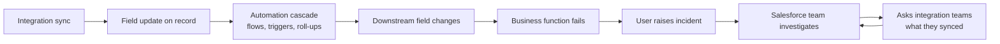
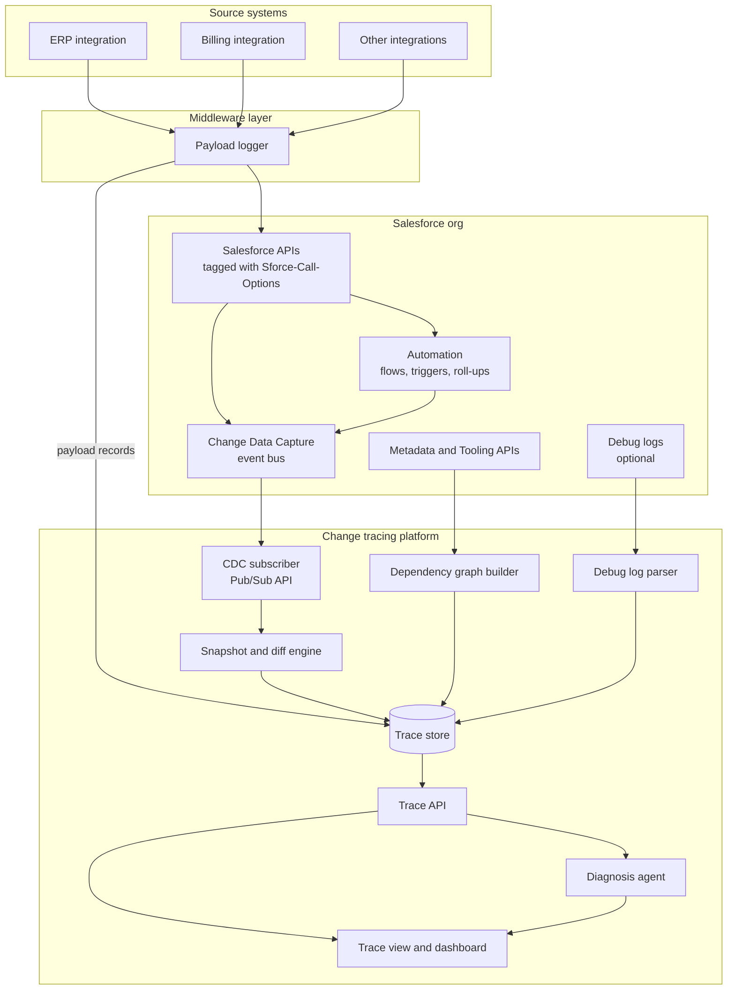
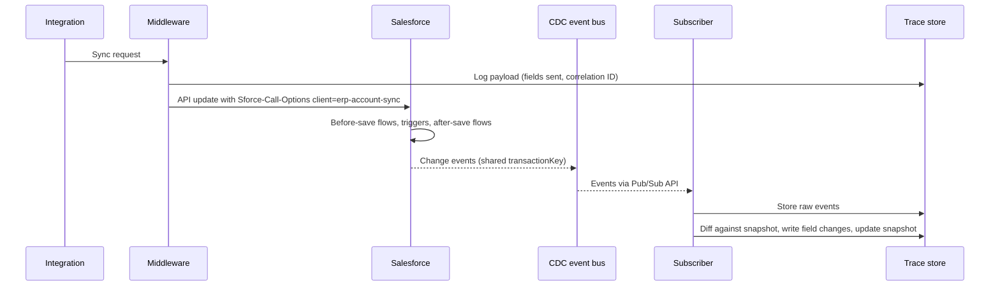
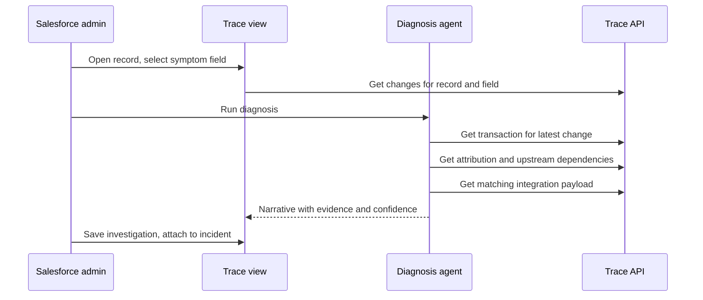

# Salesforce Integration Change Tracing: Solution Design Architecture

| | |
|---|---|
| **Status** | Draft for review |
| **Author** | Akash Biswas |
| **Date** | 7 October 2026 |
| **Scope** | Salesforce org with multiple inbound integrations |

---

## 1. Executive summary

Several external systems update records in our Salesforce org through integration users. When one of them changes a field, Salesforce automation (flows, Apex triggers, roll-ups, formulas, validation rules) reacts, sometimes several steps deep and across objects. The visible symptom is usually a broken business function somewhere else, discovered hours later by an end user.

Today we can't answer the basic diagnostic questions from inside Salesforce:

- Which fields did the integration actually change, and what were the old values?
- What did those changes cause downstream?
- Which integration, sync job or payload was responsible?

Most fields don't have Field History Tracking, so every investigation depends on the integration teams reconstructing what they sent. This is slow, and it doesn't scale as integrations grow.

This document describes a **change tracing platform** with four parts:

1. **Capture**: record every field change on the objects that matter, using Change Data Capture (CDC), and tag every integration call with its source.
2. **Correlate**: group changes by transaction, so one integration update and everything it caused are linked.
3. **Explain**: maintain a dependency graph of which automation reads and writes which fields, so we can explain why each downstream change happened.
4. **Diagnose**: a trace view and an AI diagnosis agent that, given a broken record, return the chain from the originating integration update to the symptom.

The goal is to cut root-cause analysis from hours or days (and a dependency on other teams) to minutes, done by the Salesforce team alone.

---

## 2. Problem statement

### 2.1 Current state



- Only a small set of fields have Field History Tracking (limited to 20 fields per object, or 60 with Shield Field Audit Trail).
- Debug logs are only available if a trace flag happened to be active at the time, and they're retained briefly.
- Several integrations may share one integration user, so `LastModifiedById` doesn't identify the source system.
- There is no consolidated map of which automation depends on which field.

### 2.2 A typical incident

1. The ERP integration sets `Account.Credit_Status__c` from `Good` to `Hold`.
2. A before-save flow on Account recalculates `Account.Risk_Tier__c` to `High`.
3. An after-save flow updates `Credit_Hold__c` on all open Opportunities for that Account.
4. `OpportunityTrigger` sets `Approval_Required__c = true`.
5. Hours later, a sales rep can't close a deal because an approval validation rule blocks it.

Only step 5 is visible. Steps 1 to 4 left no trace, so the investigation starts from the symptom and works backwards by guesswork.

---

## 3. Goals and non-goals

### 3.1 Goals

| # | Goal | Measure |
|---|---|---|
| G1 | Know exactly which fields an integration changed, with old and new values | 100% of changes on in-scope objects captured |
| G2 | Identify which integration (not just which user) made a change | Every integration call tagged with a source name |
| G3 | Link an integration change to every downstream change it caused | Changes grouped by transaction, across objects |
| G4 | Explain why each downstream change happened | Each downstream change attributed to a likely automation |
| G5 | Make diagnosis self-service for the Salesforce team | Median root-cause time under 30 minutes |
| G6 | Minimal impact on org performance and limits | No added synchronous Apex on integration transactions in the core design |

### 3.2 Non-goals

- **Preventing** bad updates. This platform diagnoses; prevention (bypass logic, field-level restrictions, contract testing) is a separate workstream, covered briefly in section 13.
- Replacing data backup or restore tooling.
- Tracing changes made by end users through the UI. The design captures them, but the investigation workflow focuses on integration-originated transactions.
- Real-time alerting in phase 1 (planned for phase 3).

---

## 4. Assumptions and constraints

| Area | Assumption or constraint |
|---|---|
| Salesforce edition | Enterprise or Unlimited, with API access |
| CDC entitlement | Without the CDC add-on, a limited number of entities can be selected (verify current allocation in Setup); phase 1 is sized to fit this |
| CDC retention | Change events are retained on the event bus for about 3 days, so the subscriber must persist them; replay is only possible within that window |
| Integrations | Calls arrive through middleware or directly through REST/SOAP/Bulk APIs under one or more integration users |
| Hosting | An external runtime is available for the subscriber and data store (cloud VM, container platform or existing integration platform) |
| Shield | Not assumed. If available, Field Audit Trail and Event Monitoring are optional enrichments |
| Data sensitivity | Captured field values may include PII; storage must meet the same controls as the Salesforce org |

---

## 5. Solution overview

### 5.1 Logical architecture



### 5.2 How the parts answer each question

| Question | Answered by |
|---|---|
| Which fields changed, and from what to what? | CDC events plus the snapshot and diff engine |
| Which integration did it? | `changeOrigin` in CDC (from the `Sforce-Call-Options` header), matched to the middleware payload log |
| Which of those changes did the integration send, versus automation? | Middleware payload log (fields sent) compared with the full set of changed fields |
| What else changed as a result? | Grouping by CDC `transactionKey` across objects |
| Why did each downstream field change? | Dependency graph, confirmed by debug logs when available |
| What's the plain-language explanation? | Diagnosis agent |

---

## 6. Component design

### 6.1 Integration tagging (source identification)

**Purpose:** make every API call identify the system it came from, even when integrations share a user.

**Design:**

- Every integration sends the `Sforce-Call-Options: client=<IntegrationName>` header on REST, SOAP and Bulk API calls. The value is reflected in the CDC event header field `changeOrigin`.
- Naming convention: `client=<system>-<job>`, for example `client=erp-account-sync` or `client=billing-invoice-push`.
- Where possible, each integration uses its own integration user. This is a recommendation rather than a dependency, because the header carries the identity.

**Fallback:** if an integration can't send the header, attribute by `commitUser` plus a time-window match against the middleware payload log.

**Owner:** integration teams (one-line change per connector). This is the only change required outside the Salesforce team.

### 6.2 Middleware payload logger

**Purpose:** record exactly which fields each integration sent, which CDC alone can't distinguish from automation changes on the same record.

**Design:**

- At the point where middleware calls Salesforce, log one row per record per call:
  - correlation ID (generated by middleware, also sent in the header if supported)
  - integration name and job name
  - target object and record ID (or external ID for upserts)
  - list of field API names sent, and values sent
  - timestamp and API response status
- Write to the trace store through a lightweight ingestion endpoint or a message queue.
- Values for fields classified as sensitive are hashed or omitted; the field names are always logged.

**Why it matters:** in a CDC event, changes made by the integration and by a before-save flow on the same record arrive merged in one event. The payload log is the reliable way to separate "what the integration sent" from "what automation changed".

**If middleware logging isn't possible** for a given integration, the design degrades gracefully: the trace still shows all changes in the transaction, but the integration-versus-automation split for the first record becomes an inference from the dependency graph.

### 6.3 Change Data Capture configuration

**Purpose:** capture every field change on in-scope objects, from any source, without adding Apex to the transaction.

**Design:**

- Enable CDC for in-scope objects, starting with the two or three objects involved in the most incidents (for example Account, Opportunity, and the main custom object updated by integrations).
- Use a **custom channel** (for example `/data/IntegrationTrace__chn`) containing only the in-scope objects, so the subscriber doesn't receive unrelated events.
- Optionally apply **channel filters** (for example only events where `ChangeEventHeader.commitUser` is an integration user) to reduce volume. Note that filtering out user-initiated changes means the snapshot store can drift; see section 6.5.
- Use **enriched fields** on the channel to always include identifying fields (for example `External_Id__c`, `Name`) in every event, even when they didn't change.

**Key CDC header fields used:**

| Header field | Use |
|---|---|
| `entityName` | Object |
| `recordIds` | Records affected (can be several for one event) |
| `changeType` | CREATE, UPDATE, DELETE, UNDELETE, plus GAP and OVERFLOW variants |
| `changedFields` | Fields changed in this event |
| `commitUser` | User who committed the transaction |
| `commitTimestamp` | Commit time |
| `transactionKey` | Groups all changes in one transaction, across objects |
| `sequenceNumber` | Order of events within a transaction |
| `changeOrigin` | API client identity, from the `Sforce-Call-Options` header |

**Gap and overflow events:** for very large transactions or internal processing issues, Salesforce may send gap or overflow events that don't contain field values. The subscriber must handle these by re-querying the affected records (section 6.4).

### 6.4 CDC subscriber

**Purpose:** consume change events reliably and hand them to the diff engine.

**Design:**

- External service using the **Pub/Sub API** (gRPC), subscribed to the custom channel.
- Authenticates with an OAuth JWT bearer flow using a dedicated, read-only "trace platform" integration user.
- Persists the last processed **replay ID** after each committed batch, so restarts resume without loss. Must restart well inside the event retention window.
- Decodes Avro payloads using the schema ID in each event (cache schemas).
- For GAP and OVERFLOW events, queues a re-query of the affected record IDs via REST API and records the event with a `gap` flag so the trace view can show "values reconstructed".
- Writes raw events to `change_event` (section 7) before any processing, so processing bugs can be replayed from stored data.

**Alternative for phase 1:** an Apex trigger on the change event object (`AccountChangeEvent` and so on) writing to a custom object in Salesforce. This is quicker to build but uses org storage and Apex limits, and makes the snapshot engine harder. Recommended only for a short proof of concept.

### 6.5 Snapshot and diff engine

**Purpose:** produce old and new values for each changed field. CDC events carry new values only.

**Design:**

- Maintain a `record_snapshot` table holding the last known value of each tracked field for each record.
- On initial setup, seed snapshots with a Bulk API 2.0 query of in-scope objects.
- For each incoming event, for each field in `changedFields`:
  - read the old value from the snapshot
  - write a `field_change` row (old value, new value, transaction key, sequence number, origin)
  - update the snapshot
- Process events strictly in replay order per record to keep snapshots consistent.
- **Drift correction:** a nightly job compares a sample of snapshots with live Salesforce values and corrects drift (for example after a subscriber outage longer than the retention window, or if channel filters excluded some changes).

**Tracked fields:** by default all fields on in-scope objects. A configuration list can exclude noisy or sensitive fields (for example system timestamps, large text fields).

### 6.6 Dependency graph builder

**Purpose:** explain why a downstream field changed, by knowing which automation reads and writes which fields.

**Graph model:**

- **Nodes:** fields, flows, Apex triggers, Apex classes, validation rules, formula fields, roll-up summary fields, workflow field updates (if any legacy ones remain).
- **Edges:**
  - `TRIGGERS_ON`: field to automation (field appears in entry criteria or trigger conditions)
  - `READS`: automation reads a field
  - `WRITES`: automation writes a field
  - `DERIVES`: formula or roll-up derived from a field
  - `VALIDATES`: validation rule references a field

**Sources:**

| Source | What it provides |
|---|---|
| Tooling API `MetadataComponentDependency` | Which components reference which fields (where-used); large result sets need Bulk API 2.0 |
| Metadata API retrieve of `Flow` | Parsed XML: trigger object, trigger type (before/after save), entry conditions, record update elements and field assignments |
| Apex trigger and class source | Static scan for field references and DML on fields |
| `ValidationRule`, `CustomField` (formula, roll-up) metadata | Field references in formulas |

**Known limitations, stated in every trace:**

- Dynamic Apex (`record.get(fieldName)`, `record.put(...)`) and dynamic SOQL won't be detected by static analysis.
- Some managed-package components are hidden.
- Flows invoked from other flows or Apex need the call chain resolved separately.

These limitations are why debug log confirmation exists (section 6.7).

**Refresh:** rebuild on every deployment (CI pipeline step) and nightly as a safety net. Store a version per build so a trace from last month is explained with last month's metadata.

### 6.7 Debug log parser (optional enrichment)

**Purpose:** turn an inferred automation chain into a confirmed one.

**Design:**

- During an active investigation, or permanently for selected integration users in non-peak hours, set trace flags on the integration user with a log level that includes workflow and Apex code at INFO.
- Parse retrieved logs for flow interview starts, flow element executions, trigger entries and DML statements, and link them to the corresponding transaction by user, record ID and time window.
- Store parsed steps in `automation_step`.

**Constraints:** debug logs are capped in size and retention and can be truncated for heavy transactions. Treat them as evidence when present, never as a required input.

### 6.8 Trace store

**Recommended technology:** PostgreSQL (managed). The graph is small enough for relational tables with recursive queries. A graph database is unnecessary unless the org has tens of thousands of automation components.

**Retention:** 90 days of field changes online, 1 year archived. Tune to incident patterns and data policy.

### 6.9 Trace API

**Purpose:** a single service the UI and the agent both use.

| Endpoint | Returns |
|---|---|
| `GET /records/{id}/changes?from&to&field` | Field changes for a record, with origin, grouped by transaction |
| `GET /transactions/{transactionKey}` | Every change in a transaction across all objects, ordered by sequence |
| `GET /fields/{object}.{field}/upstream?depth` | Automation and fields that can change this field |
| `GET /fields/{object}.{field}/downstream?depth` | Automation and fields this field can affect |
| `GET /payloads?integration&recordId&from&to` | Middleware payload records |
| `GET /transactions/{transactionKey}/attribution` | Each changed field labelled as integration-sent, automation (with likely component and confidence), or unknown |
| `POST /investigations` | Saves an investigation with notes, for incident records |

### 6.10 Attribution logic

For each transaction, every changed field gets one label:

1. **Integration-sent:** the field appears in a matching middleware payload (same record, same integration, within a small time window).
2. **Automation, confirmed:** a parsed debug log shows a specific component writing the field in this transaction.
3. **Automation, inferred:** the dependency graph contains a component with a `WRITES` edge to this field and a `TRIGGERS_ON` edge from a field that changed earlier in the same transaction. Confidence is high if exactly one candidate exists, medium if several.
4. **Unknown:** none of the above. Flagged for review, and usually a sign of dynamic Apex or a missing graph edge.

The chain is then assembled by walking from the integration-sent fields through inferred or confirmed edges to each downstream change.

### 6.11 Diagnosis agent

**Purpose:** given a symptom, produce a plain-language root-cause narrative with evidence.

**Inputs:** a record ID and optionally a field, a time window or an incident description.

**Design:**

- An LLM (for example Claude through the Anthropic API) with tool access to the Trace API endpoints only, read-only.
- Workflow:
  1. Find recent changes to the symptom field on the record.
  2. Load the transaction for each candidate change.
  3. Walk upstream to the integration-sent fields and identify the integration and payload.
  4. Pull attribution and, where present, debug log evidence.
  5. Write a narrative: what was sent, what fired, what changed, why the symptom occurred, and a confidence level for each link.
- The agent cites trace evidence (transaction keys, component names) for every claim, so a human can verify it.
- The agent never changes Salesforce data or metadata.

**Example output:**

> At 14:32 on 7 October, `erp-account-sync` set `Credit_Status__c` on Acme Corp from Good to Hold (payload 8f2c…). In the same transaction, before-save flow `Account_Risk_Calc` set `Risk_Tier__c` to High (inferred, high confidence), and after-save flow `Account_Sync_Opps` set `Credit_Hold__c` on 3 open opportunities (inferred, high confidence). `OpportunityTrigger` then set `Approval_Required__c` to true (confirmed by debug log). The validation rule blocking the rep is behaving as designed; the root cause is the credit status sent by the ERP system.

### 6.12 Trace view and dashboard

**Trace view (per record):** timeline of changes grouped by transaction, each row showing time, object and field, old to new value, source label (integration name, flow name, trigger name), and confidence. A button runs the diagnosis agent.

**Dashboard (org level):**

- Changes per integration per day, per object
- Top fields changed by integrations
- Fields with the largest downstream fan-out (from the graph): the riskiest fields to let integrations write
- Transactions with "unknown" attribution (graph gaps to fix)
- Investigations opened and median time to root cause

**Options for hosting:**

| Option | Pros | Cons |
|---|---|---|
| Lightning web component in Salesforce calling the Trace API via Named Credential | Admins stay in Salesforce; record page tab is natural | Callout limits; needs Named Credential setup |
| Standalone web app | Fastest to build; no Salesforce limits | Another tool to log into |
| Existing BI tool on the trace store | Dashboards are cheap | Weak for per-record trace view |

Recommendation: standalone web app in phase 2, with a Lightning record page component in phase 3.

---

## 7. Data model

```mermaid
erDiagram
    CHANGE_EVENT ||--o{ FIELD_CHANGE : contains
    INTEGRATION_PAYLOAD ||--o{ PAYLOAD_FIELD : contains
    FIELD_CHANGE }o--o| AUTOMATION_STEP : "confirmed by"
    METADATA_NODE ||--o{ METADATA_EDGE : from
    METADATA_NODE ||--o{ METADATA_EDGE : to
    RECORD_SNAPSHOT

    CHANGE_EVENT {
        string replay_id PK
        string transaction_key
        int sequence_number
        string entity_name
        string change_type
        string commit_user
        string change_origin
        timestamp commit_timestamp
        json raw_payload
        bool is_gap
    }
    FIELD_CHANGE {
        bigint id PK
        string replay_id FK
        string transaction_key
        string record_id
        string object_name
        string field_name
        string old_value
        string new_value
        string attribution
        string attributed_component
        string confidence
    }
    RECORD_SNAPSHOT {
        string record_id PK
        string field_name PK
        string value
        string last_replay_id
        timestamp updated_at
    }
    INTEGRATION_PAYLOAD {
        string correlation_id PK
        string integration_name
        string job_name
        string object_name
        string record_id
        timestamp sent_at
        string api_status
    }
    PAYLOAD_FIELD {
        string correlation_id FK
        string field_name
        string value_sent
    }
    AUTOMATION_STEP {
        bigint id PK
        string transaction_ref
        string component_type
        string component_name
        string record_id
        string field_written
        timestamp occurred_at
    }
    METADATA_NODE {
        string node_id PK
        string node_type
        string api_name
        string object_name
        string graph_version
    }
    METADATA_EDGE {
        string from_node FK
        string to_node FK
        string edge_type
        string graph_version
    }
```

Indexes: `field_change (record_id, field_name, commit_timestamp)`, `field_change (transaction_key)`, `integration_payload (record_id, sent_at)`, `metadata_edge (to_node, edge_type)` and `(from_node, edge_type)`.

---

## 8. Key flows

### 8.1 Capture flow



### 8.2 Investigation flow



---

## 9. Non-functional requirements

| Area | Requirement |
|---|---|
| Completeness | No lost events: replay ID checkpointing, alert if the subscriber is down for more than 4 hours (well inside the retention window) |
| Latency | Changes visible in the trace view within 2 minutes of commit |
| Org impact | No synchronous Apex added to integration transactions in the core design; Tooling and Metadata API calls scheduled off-peak |
| Scale | Size for peak daily integration volume times 3; Bulk integrations can produce large bursts of events |
| Availability | Subscriber and API: 99.5%; the trace platform is diagnostic, not on the business critical path |
| Observability | Metrics for event lag, events per minute, gap events, attribution "unknown" rate |

---

## 10. Security and compliance

- **Least privilege:** the trace platform's Salesforce user has read-only access and the "Subscribe to Change Data Capture events" permission, plus "View Setup and Configuration" for metadata. No modify permissions.
- **Credentials:** JWT bearer flow with a certificate stored in a secrets manager; no passwords.
- **Data protection:** encryption at rest and in transit for the trace store. Field values for fields classified as PII or sensitive are masked or hashed at capture time, controlled by a configuration list. Field names are always kept, because they're what diagnosis needs.
- **Access:** trace view and API restricted to the Salesforce platform team and approved integration leads, with SSO.
- **Retention and deletion:** retention as in section 6.8; support deletion by record ID for data subject requests.
- **AI agent:** read-only tools; data sent to the LLM provider must be covered by the organization's approved data processing terms. Masked fields stay masked in prompts.

---

## 11. Limits and risks

| Risk | Impact | Mitigation |
|---|---|---|
| CDC entity allocation too small for all objects | Some objects untraced | Start with highest-incident objects; evaluate the CDC add-on if value is proven |
| Event delivery allocation exceeded during bulk loads | Missed events | Monitor usage in Setup; use channel filters; schedule bulk jobs; buy add-on if needed |
| Subscriber outage beyond retention window | Gap in history, snapshot drift | Alerting, auto-restart, drift correction job |
| Integration teams don't add the header | Can't separate integrations sharing a user | Fallback matching by user and time; make the header a requirement in integration standards |
| Dynamic Apex not visible to static analysis | "Unknown" attribution | Debug log enrichment; track unknown rate; add manual edges to the graph |
| PII in captured values | Compliance exposure | Masking configuration at capture, access controls, retention |
| Over-building before value is proven | Wasted effort | Phased delivery with an explicit go/no-go after phase 1 (section 12) |

---

## 12. Implementation roadmap

### Phase 1: prove the value (2 to 3 weeks)

- Enable CDC on the two or three highest-incident objects with a custom channel.
- Build the subscriber, snapshot engine and trace store.
- Ask the highest-volume integration to add the `Sforce-Call-Options` header.
- Provide trace lookup by SQL queries or a minimal page.
- **Exit criteria:** at least one real incident diagnosed from trace data without asking an integration team. If this doesn't happen within the phase, stop and reassess.

### Phase 2: explain (3 to 4 weeks)

- Build the dependency graph builder and add it to the CI pipeline.
- Add middleware payload logging for the main integrations.
- Implement attribution logic and the Trace API.
- Release the standalone trace view.

### Phase 3: diagnose and scale (3 to 4 weeks)

- Diagnosis agent.
- Org-level dashboard.
- Lightning record page component.
- Debug log enrichment for selected integration users.
- Alerts on unusual integration activity (for example a spike in changes to a high-fan-out field).

### Phase 4: prevent (ongoing)

Use what the platform reveals to drive the preventive measures in section 13.

---

## 13. Preventive measures informed by the platform

The trace data will show which fields and automations cause most incidents. Typical fixes:

- **Entry conditions:** tighten flow entry criteria so automation runs only when the relevant field actually changes (`ISCHANGED`-style conditions) and only for the intended scenarios.
- **Integration bypass:** a custom permission or hierarchy custom setting checked by flows and triggers, so specific automation can skip integration updates where the business agrees.
- **Field-level security:** remove edit access for integration users on fields they shouldn't write.
- **High fan-out review:** any new integration field mapping to a field with large downstream fan-out (from the dashboard) requires review.
- **Regression tests:** automated tests that replay representative integration payloads in a sandbox and compare resulting field changes against a baseline.

---

## 14. Alternatives considered

| Option | Why not chosen as the core |
|---|---|
| Enable Field History Tracking on more fields | Hard limit on fields per object, no transaction grouping, no cross-object linking |
| Shield Field Audit Trail and Event Monitoring | Raises field limits and adds API event logs, but still no transaction-level cascade view; adds licence cost. Good optional enrichment if already owned |
| Generic Apex audit trigger on every object | Adds synchronous work and limits risk to every integration transaction; can't see changes made by other automation after it runs without careful ordering |
| Always-on debug logs | Size and retention caps, performance overhead, truncation |
| Commercial impact analysis tools (for example Elements.cloud) or free ones (for example HappySoup) | Strong for the dependency graph and worth evaluating instead of building section 6.6, but they don't capture runtime data changes |
| Logging framework such as Nebula Logger | Excellent for explicit logging inside flows and Apex; complements this design but only logs where log statements are added |

---

## 15. Open questions

1. Which two or three objects have caused the most incidents in the last quarter?
2. Which middleware platform do the integrations use, and can it add the `Sforce-Call-Options` header and log payloads centrally?
3. How many integrations share an integration user today?
4. What is the current CDC entity and event delivery allocation in the org?
5. Is Shield (Field Audit Trail, Event Monitoring) licensed?
6. Where should the trace platform be hosted, and which data classification applies to captured values?
7. Is there an approved LLM provider and data processing agreement for the diagnosis agent?

---

## 16. Glossary

| Term | Meaning |
|---|---|
| CDC | Change Data Capture: Salesforce feature that publishes an event for every record change on selected objects |
| `transactionKey` | Identifier shared by all change events from one Salesforce transaction |
| Replay ID | Position of an event on the event bus, used to resume a subscription |
| Fan-out | Number of fields and automations that can be affected, directly or indirectly, by a change to one field |
| Attribution | Labelling a field change as sent by an integration or caused by a specific automation |
| Gap event | CDC event signalling that changes happened but field values couldn't be included |
